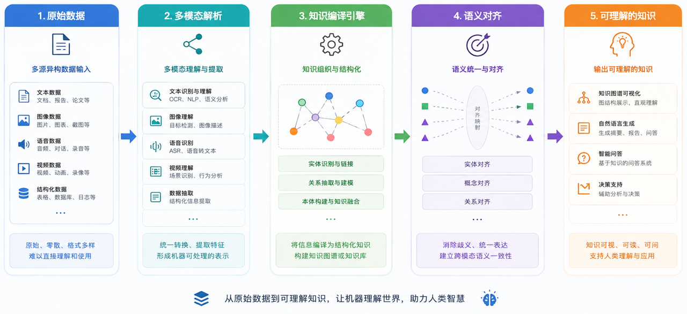

<p align="center">
  
</p>

<p align="center">
  <strong>AI 多模态领域知识引擎</strong><br />
  面向企业Agent · 支持Jonex Wiki 与 Graph 本体模式双引擎驱动
</p>

<hr />
<br />

<p align="center">
  
  
  
  
    
</p>

<p align="center">
  <a href="README.md">English</a> | 中文
</p>

<p align="center">
  <a href="#概览">概览</a> |
  <a href="#快速开始">快速开始</a> |
  <a href="#本地开发">本地开发</a> |
  <a href="#api-快速入门">API 快速入门</a> |
  <a href="#集成生态">集成生态</a> |
  <a href="#文档与视频解析">文档与视频解析</a> |
  <a href="#运行环境要求">运行环境要求</a> |
  <a href="#社区与安全">社区与安全</a> |
  <a href="#许可证">许可证</a>
</p>

<p align="center">
  <strong>
  如果你认可Jonex的价值，欢迎点亮 ⭐ Star，支持项目持续迭代！
  </strong>
</p>

---

## 概览

Jonex 将一站式多模态解析引擎与 AI 就绪的知识引擎融为一体。本体在检索开始之前，就把领域推理编译进知识层。

它是一个端到端的企业级 AI 知识平台，把原始内容转化为可复用的知识服务。Jonex 在一个受治理的统一系统中串联数据接入、多模态解析、领域知识编译、向量与图索引、可溯源的检索、反馈闭环和业务应用。

<p align="center">
  
</p>

## 快速开始

Docker Compose 是运行完整平台最快的方式。

### Docker 环境要求

- Docker Engine 或 Docker Desktop
- 支持 Buildx 的 Docker Compose v2
- macOS 或 Linux 上的 `make`
- 首次构建需要足够的磁盘空间与时间——会下载容器镜像、Python 依赖和 RAG 模型

### 1. 克隆仓库

```bash
git clone https://github.com/yuezhiai/jonex.git
cd jonex
```

### 2. 初始化配置

```bash
make init
```

该命令会生成：

- `deploy/.env`：平台、数据库、对象存储与 LLM 网关配置
- `deploy/.env.rag`：LightRAG、Embedding 与解析配置
- `deploy/.env.mcp`：MCP 服务器配置
- Shell、核心业务、生态管理、平台管理与 Dev Gateway 的前端 `.env` 文件

### 3. 配置模型连接

在 `deploy/.env` 中至少配置一个 OpenAI 兼容的 LLM 与 Embedding 提供商：

```env
LLMGW_UPSTREAM_LLM_HOST=https://your-openai-compatible-host/v1
LLMGW_UPSTREAM_LLM_API_KEY=your_llm_api_key

LLMGW_UPSTREAM_EMBED_HOST=https://your-embedding-host/v1
LLMGW_UPSTREAM_EMBED_API_KEY=your_embedding_api_key
```

如果你的模型名称与默认值不同，请更新对应的 `LLM_MODEL` / `EMBEDDING_MODEL` 键——它们同时定义在 `deploy/.env` 与 `deploy/.env.rag` 中，其中 `EMBEDDING_MODEL` 必须两处保持一致（用于构建向量索引）。

保持 `deploy/.env` 与 `deploy/.env.rag` 中的 `LIGHTRAG_API_KEY` 一致。如需音频、视频或高级图像处理，还要在 `deploy/.env` 中配置 VLM 与 ASR 连接。

### 4. 构建并启动

```bash
make build
make up
make ps
```

首次构建会先创建共享的 `jonex/python-base:local` 镜像，然后 Compose 并行构建平台各服务。

排查问题时可用 `make logs` 跟踪服务日志；按 `Ctrl+C` 停止跟踪，平台不会停止。

### 5. 打开 Jonex

访问：

```text
http://localhost/
```

本地演示账号：

```text
用户名：admin
密码：admin123
租户：tenant_jonex_demo
```

> **安全警告：** 以上账号仅用于本地评估。在将 Jonex 绑定到非回环地址、共享部署或接入任何网络之前，请修改或删除默认管理员账号，并按 [SECURITY.md](SECURITY.md) 完成生产环境检查清单。

### Windows PowerShell

```powershell
.\jonex.ps1 init
.\jonex.ps1 build
.\jonex.ps1 up
.\jonex.ps1 ps
```

需要跟踪服务日志时使用 `.\jonex.ps1 logs`。

若脚本执行受限：

```powershell
powershell -ExecutionPolicy Bypass -File .\jonex.ps1 help
```

### 停止平台

```bash
make down
```

Windows 下：

```powershell
.\jonex.ps1 down
```

## 本地开发

本地开发使用根目录环境文件与 VSCode Debug，与 `deploy/` 下的 Docker 部署配置相互独立。

### 工具链要求

- Python `>=3.12.13`
- Node.js `>=20.18.0`（推荐 Node.js 22 LTS）
- pnpm `>=9.0.0`
- 当前稳定版 uv

### 初始化本地环境

```bash
cp .env.local.example .env.local
cp .env.rag.local.example .env.rag.local
mkdir -p .vscode
cp docs/examples/launch.json.example .vscode/launch.json
make frontends-install
```

在 `.env.local` 中把本地中间件地址设为 `127.0.0.1`，或用远程基础设施主机替换 `SERVER_IP`。后端进程从 VSCode 的 Run and Debug 启动；Makefile 不再启动宿主机后端进程。

启动所需的本地依赖：

```bash
make dev-infra-up  # PostgreSQL、Redis、etcd、MinIO 与 Milvus
# 或者本地运行完整 RAG 技术栈时：
make dev-deps-up   # 中间件 + LightRAG 与 Atomic RAG
```

在单独的终端中启动前端网关与应用：

```bash
make dev-gateway
make dev-frontend
```

打开 `http://localhost:8080`。

## 五分钟完成首次知识检索

1. 使用本地演示账号 `admin / admin123` 在演示租户 `tenant_jonex_demo` 登录。
2. 打开核心业务，创建或选择一个领域空间。
3. 创建知识库，并用文件夹或标签组织内容。
4. 针对要接入的内容选择合适的解析配置（parser profile）或预设。
5. 上传文件，或配置 REST API / S3 兼容数据源。
6. 等待多模态解析与知识编译完成。
7. 检查解析结果、编译后的本体、关系与知识图谱。
8. 打开知识检索，提出问题、核对引用来源并提交反馈。

## API 快速入门

所有外部 API 均通过统一 Gateway 暴露。

### 登录

```bash
curl -X POST "http://localhost/api/v1/auth/login" \
  -H "Content-Type: application/json" \
  -H "X-Tenant-ID: tenant_jonex_demo" \
  -d '{"username":"admin","password":"admin123"}'
```

使用返回的 `access_token` 调用本体优先搜索：

```bash
curl -X POST "http://localhost/api/v1/knowledge-base/search/ontology" \
  -H "Authorization: Bearer <access_token>" \
  -H "Content-Type: application/json" \
  -d '{
    "query": "What are the key risks described in these documents?",
    "knowledge_base_ids": ["<knowledge-base-id>"],
    "mode": "hybrid",
    "top_k": 5,
    "with_reasoning": true
  }'
```

响应包含回答、命中的知识库、本体实例、RAG 用量、结构化来源引用，以及可选的推理轨迹。

生产环境中浏览器只与 Frontend Gateway 通信。业务 API、能力服务与基础设施组件不会直接暴露给前端应用。

## 集成生态

- 可接入 [RAG-Anything](https://github.com/HKUDS/RAG-Anything) 与 [MinerU](https://github.com/opendatalab/MinerU)，用于多模态内容处理与文档解析
- 可通过图增强检索适配器接入 [LightRAG](https://github.com/HKUDS/LightRAG)
- [Neo4j](https://neo4j.com/) 与 [Milvus](https://milvus.io/) 是内置的图存储与向量存储集成
- OpenAI 兼容端点提供可替换的 LLM、Embedding、Rerank、VLM 与 ASR 服务

## 文档与视频解析

- 用 Docker Compose 部署 Atomic RAG 解析器，作为可独立扩展的能力运行，或通过解析配置（parser profile）注册兼容的解析服务
- 使用 ASR、关键帧与视觉语言模型在本地处理视频，或将媒体分析路由到已配置的云服务
- 解析 Worker 与核心平台相互独立地扩缩容；GPU 加速对模型密集型负载是可选项

## 运行环境要求

| 部署形态 | 要求 |
|---|---|
| 核心平台 | Docker Engine 或 Docker Desktop、支持 Buildx 的 Docker Compose v2、PostgreSQL 15、Redis 7 与对象存储 |
| 向量检索 | Milvus、etcd 以及 MinIO 或兼容替代品 |
| 本体图谱 | 受支持的图数据库服务；Neo4j 为内置集成 |
| CPU 解析 | 适合评估与轻量负载；容量随文件大小与并发度扩展 |
| 加速解析 | 可选的 NVIDIA GPU 与 Container Toolkit，用于加速 OCR、ASR 与视觉语言处理；VRAM 取决于所选模型 |
| 云端解析 | 兼容的解析或媒体分析端点、凭据、对象存储与出网访问 |

## 社区与安全

- 提出 issue 或 pull request 前请阅读 [CONTRIBUTING.md](CONTRIBUTING.md)。
- 社区参与受 [CODE_OF_CONDUCT.md](CODE_OF_CONDUCT.md) 约束。
- 请按 [SECURITY.md](SECURITY.md) 私下报告漏洞；请勿在公开 issue 中包含漏洞细节。
- 发布说明与兼容性变更见 [CHANGELOG.md](CHANGELOG.md)。

## 许可证


本仓库采用 [Jonex 开源许可证（Jonex Open Source License）](LICENSE)，基于 Apache License 2.0 并附加额外条件。第三方组件仍归各自许可证管理，详见 [NOTICE](NOTICE) 与 [THIRD_PARTY_NOTICES.md](THIRD_PARTY_NOTICES.md)。


---

<div align="center">

### **Jonex 悦溪** —— AI 多模态领域知识引擎

*为企业 Agent 提供可推理、可溯源、可调用的本体知识服务*

<br/>

### 喜欢Jonex？

<a href="https://github.com/yuezhiai/jonex/stargazers">
  
</a>
<a href="https://github.com/yuezhiai/jonex/network/members">
  
</a>

**点击 ⭐ Star 支持Jonex持续迭代，感谢！**

</div>

© 2026 JONEX
